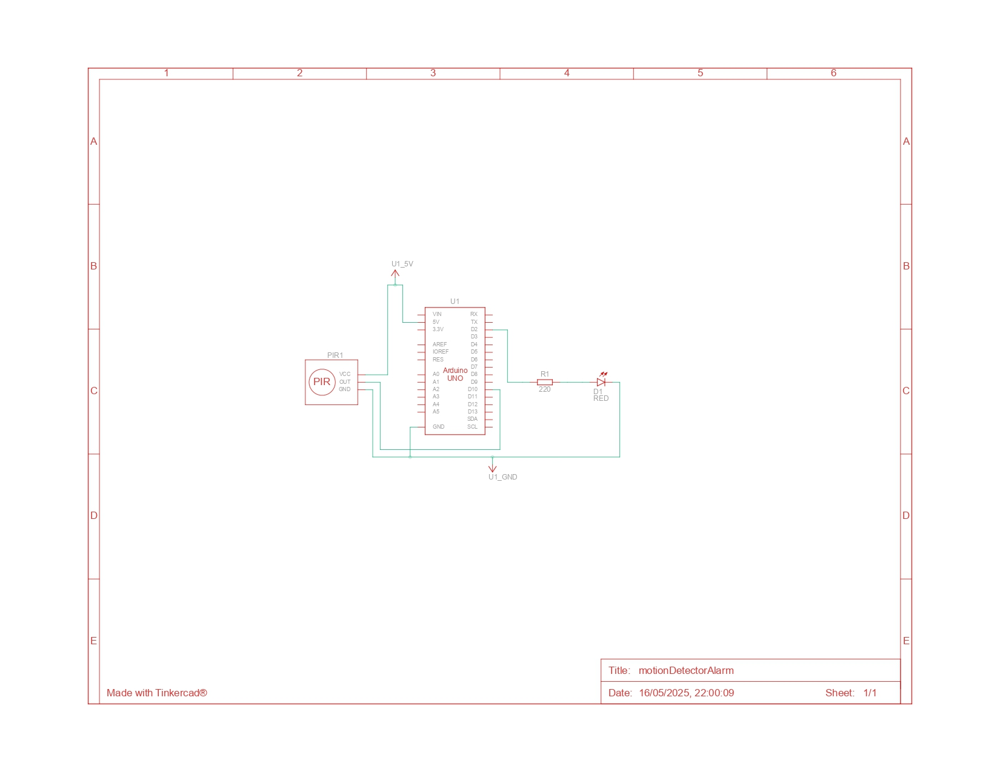

---

# Motion Detector Alarm Project

This is a basic IoT project using an Arduino, a PIR motion sensor, and an LED. The LED turns on when motion is detected and turns off when there is no movement. Serial output logs the motion detection status in real time.

---

## Components Used

* Arduino Uno
* PIR Motion Sensor
* LED
* 220Ω Resistor (for LED)
* Breadboard & Jumper Wires

---

## Circuit Description

* The PIR sensor output is connected to **digital pin 10** of the Arduino.
* The LED is connected to **digital pin 2** through a 220Ω resistor.
* When the PIR sensor detects motion, the LED lights up and "Motion Detected!" is printed in the Serial Monitor.
* When no motion is detected, the LED turns off and "No Motion Detected!" is shown.

---

## Circuit Image



---

## Code Summary

```cpp
const int pirPin = 10;         // PIR sensor output connected to digital pin 10
const int ledPin = 2;          // LED connected to digital pin 2

void setup() {
  pinMode(pirPin, INPUT);      // PIR sensor as input
  pinMode(ledPin, OUTPUT);     // LED as output
  Serial.begin(9600);          // For monitoring PIR status 
}

void loop() {
  int motionState = digitalRead(pirPin); // Read PIR sensor

  if (motionState == HIGH) {
    digitalWrite(ledPin, HIGH);          // Turn ON LED
    Serial.println("Motion Detected!");
  } else {
    digitalWrite(ledPin, LOW);           // Turn OFF LED
    Serial.println("No Motion Detected!");
  }
  delay(500); // Small delay to stabilize reading
}
```

---

## Note

This project was simulated on **TinkerCAD** as part of my IoT and Arduino learning journey. It's a simple demonstration of using a PIR motion sensor in real-world applications like security systems.

---

