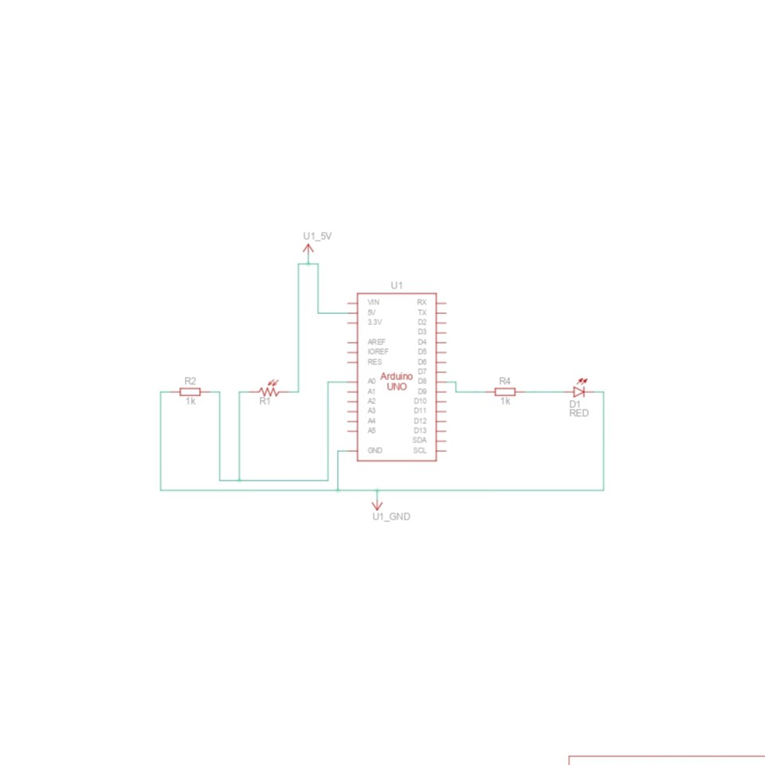

#  LDR-Based LED Control Project

This is a basic IoT project using an Arduino, an LDR (Light Dependent Resistor), and an LED. The LED turns on or off depending on the surrounding light level.

---

##  Components Used

- Arduino Uno
- LDR Sensor
- 10kΩ Resistor (for LDR)
- 220Ω Resistor (for LED)
- LED
- Breadboard & Jumper Wires

---

##  Circuit Description

- The LDR is connected to analog pin A0.
- The LED is connected to digital pin 8.
- When the light falls below a certain threshold, the LED turns ON.

---

##  Code Summary

```cpp
int ledPin = 8;
int ldrPin = A0;
int threshold = 500;

void setup() {
  pinMode(ledPin, OUTPUT);
  Serial.begin(9600);
}

void loop() {
  int ldrValue = analogRead(ldrPin);
  if (ldrValue < threshold) {
    digitalWrite(ledPin, HIGH);
  } else {
    digitalWrite(ledPin, LOW);
  }
  delay(200);
}


Circuit Image



Note:
This project was built and simulated on TinkerCAD. It's part of my learning journey in IoT and Arduino development.
