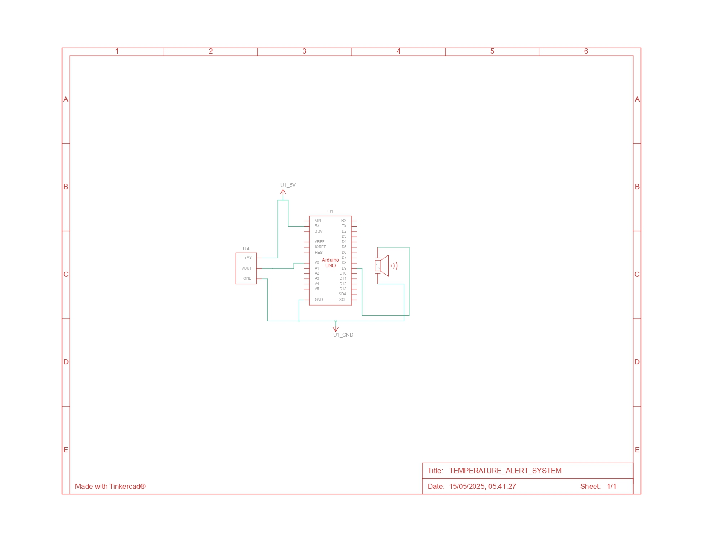

Here’s a polished README for your **Temperature Alert System** project, modeled after your previous one but improved a bit:

---

# Temperature Alert System

This project is a simple Arduino-based temperature alert system. It uses a temperature sensor to measure the ambient temperature and activates a buzzer when the temperature exceeds a set threshold.

---

## Components Used

* Arduino Uno
* Analog Temperature Sensor (e.g., LM35 or similar)
* Buzzer
* Breadboard & Jumper Wires

---

## Circuit Description

* The temperature sensor is connected to analog pin A0.
* The buzzer is connected to digital pin 9.
* When the temperature crosses the threshold (30°C), the buzzer sounds an alert.

---

## Code Summary

```cpp
const int tempSensorPin = A0;
const int buzzerPin = 9;
float temperature = 0.0;
const float threshold = 30.0;  // Temperature threshold in Celsius

void setup() {
  pinMode(buzzerPin, OUTPUT);
  Serial.begin(9600);
}

void loop() {
  int analogValue = analogRead(tempSensorPin);
  temperature = (analogValue * 0.4798 - 48.95); // Convert analog to Celsius
  Serial.print("Temperature: ");
  Serial.print(temperature);
  Serial.println(" C");

  if (temperature > threshold) {
    digitalWrite(buzzerPin, HIGH);
  } else {
    digitalWrite(buzzerPin, LOW);
  }
  delay(500);
}
```

---

## Circuit Image



---

**Note:**
This project was built and tested on TinkerCAD. It’s part of my learning journey in IoT and Arduino development.

---

---


